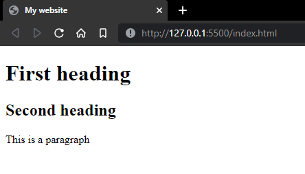

# HTML Elements

## What are HTML elements?
A component of an HTML document that tells a web browser how to structure a part of the HTML document.

## Components of an HTML element
An HTML element includes a start tag, content, and an end tag.

```html
<tagname> Content </tagname>
```

## Important HTML elements
```html
<!DOCTYPE html> -declares the document as HTML5 (should be at the top of every HTML document)

<html> -is the container for all other HTML elements except for the <!DOCTYPE> tag

<head> -contains specific information about a web page which is known as metadata. 

<title> -declares the title of the html document

<body> -defines the document's body which includes all visible content

<h1> -defines the header

<p> -defines a paragraph
```
---
## Sample
Code:
```html
<!DOCTYPE html>
<html>
<head>
    <title>My website</title>
</head>
<body>
    <h1>First heading</h1>
    <h2>Second heading</h2>
    <p>This is a paragraph</p>
</body>
```

Output:




~Nolawi
