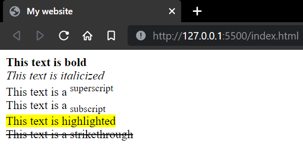

# Formatting HTML elements
Formatting HTML elements are used to style and display special types of text.

# How to use formatting elements
```html
<tagname>Text goes here</tagname>
```

# Important formatting elements
```html
<b> -used to make text bold
<i> -used to italicize text
<sub> -used to convert text to subscript
<sup> -used to convert text to superscript
<mark> -used to highlight text
<strike> -used to create a strikethrough
```

# Sample
Code:
```html
<!DOCTYPE html>
<html>
<head>
    <title>My website</title>
</head>
<body>
    <!--The <br> tag creates a new line-->
    <b>This text is bold</b><br>
    <i>This text is italicized</i><br>
    This text is a <sup>superscript</sup><br>
    This text is a <sub>subscript</sub><br>
    <mark>This text is highlighted</mark><br>
    <strike>This text is a strikethrough</strike><br>
</body>
```

Output:



~Nolawi
