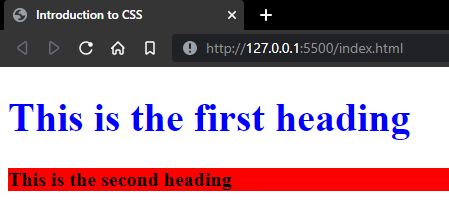

# What is CSS?
CSS stands for Cascading Style Sheets, and it is used to style and layout your website.

## How to use CSS
Create a new file then end the file name with `.css`

To connect the css to the html document, add a link in the `<head>` tag your html document.
```html
<!DOCTYPE html>
<html>
<head>
  <link rel="stylesheet" href="css_file_name.css">
</head>
</html>
```
---
## `<div>` elements in html
`<div>` elements are used to section code and layout/decorate them individually in css.

## Components of a `<div>` tag
```html
<div class="div_name">Content goes here</div>
```

## Sample
Code:

HTML document: (index.html)
```html
<!DOCTYPE html>
<html>
<head>
  <link rel="stylesheet" href="styles.css">
</head> 
<body>

<div class="example"><p>This is a paragraph.</p></div>

</body>
</html>
```

CSS document: (styles.css)
```css
.example{
    font-size: 20px;
    color:rgb(255,255,0);
}
```

Output:



~Nolawi