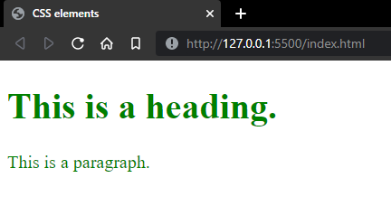

# Sectioning code using `<div>`
`<div>` elements are used to section code and layout/decorate them individually in css.

## Components of a `<div>` tag
```html
<div class="div_name">Content goes here</div>
```

## Sample
Code:

HTML document: (index.html)
```html
<!DOCTYPE html>
<html>
<head>
  <title>CSS elements</title>
  <link rel="stylesheet" href="styles.css">
</head> 
<body>

<div class="example">
  <h1>This is a heading.</h1>
  <p>This is a paragraph.</p>
</div>

</body>
</html>
```

CSS document: (styles.css)
```css
.example{ 
  font-size: 20px;
  color:green;
}
```
Output:



~Nolawi