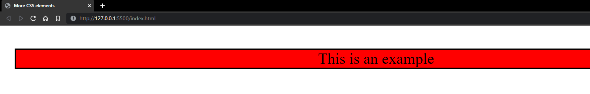

# More CSS elements

## Comments 
To include comments in your css file, use the `/* */` tag.
```css
/* This is a comment */
```

---

## Some more important CSS elements include: 

```css
text-align: center; /* used to set the horizonal alignment of text */

margin-left: 20px; /* sets the left margin of an element */

margin-right: 20px; /* sets the right margin of an element */

margin-top: 20px; /* sets the top margin of an element */

margin-bottom: 20px; /* sets the bottom margin of an element */

border-style: solid; /* sets a border around the text */

font-family: cursive: /* used to change the font of a text */
```
---
## Sample

Code:

HTML document: (index.html)
```html
<!DOCTYPE html>
<html>
<head>
  <title>More CSS elements</title>
  <link rel="stylesheet" href="styles.css">
</head> 
<body>

<p>This is an example</p>

</body>
</html>
```

CSS document: (styles.css)
```css
p{
  text-align: center;
  margin-left: 30px; /* The box is 30 pixels away from the left */
  margin-top: 60px; /* The box is 60 pixels away from the top */
  border-style: solid;
  font-family: "Times New Roman";
  background-color: red;
  font-size: 40px;
}
```
Output: 



~Nolawi