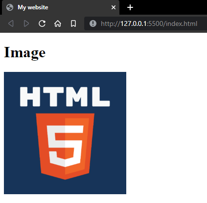
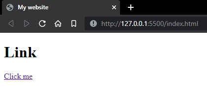

# More HTML elements 

## Images
To include images in your HTML document, use the `` tag.

```html

```

### Sample
Code:
```html
<!DOCTYPE html>
<html>
<head>
    <title>My website</title>
</head>
<body>
    <h1>Image</h1>
    
</body>
```

Output:



---
## Links
To include links in your HTML document, use the `<a>` tag.

```html
<a href="link goes here">link text goes here</a>
```

### Sample
Code:
```html
<!DOCTYPE html>
<html>
<head>
    <title>My website</title>
</head>
<body>
    <h1>Link</h1>
    <a href="https://github.com/MWCSC/documentation/tree/master/webdev">Click me</a>
</body>
```

Output:



---

## Comments
Comments are used to document your code and keep everything organized. Comments do not show up on the browser.

To include comments in your HTML document, use the `<!-- -->` tag.

### Example:

```html
<!-- This is a comment -->
<!-- Comments are very helpful when working on projects with other people -->
```

~ Nolawi